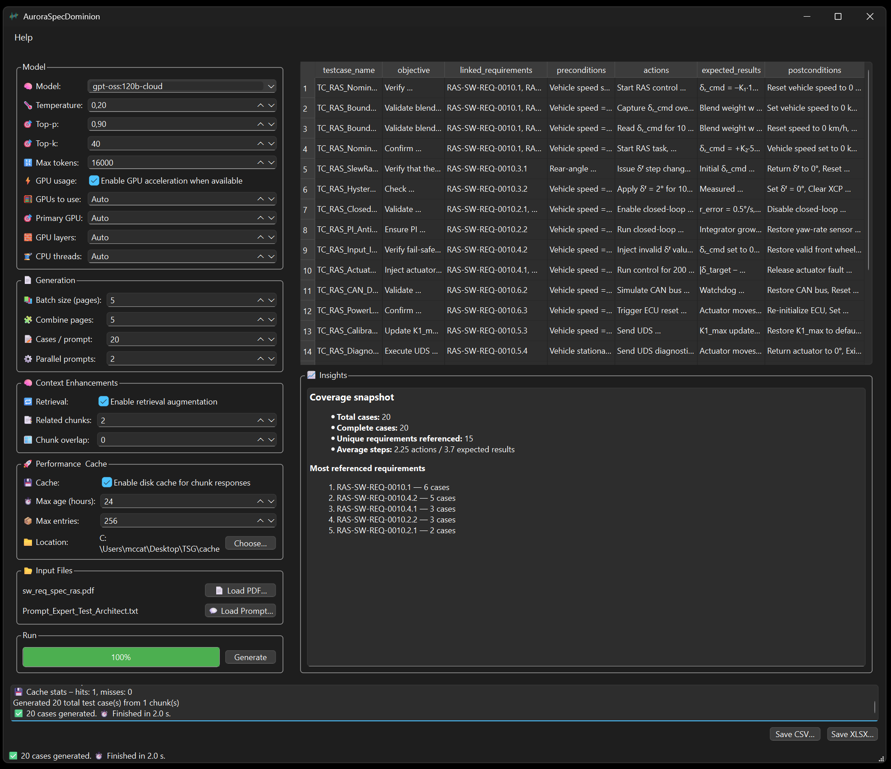
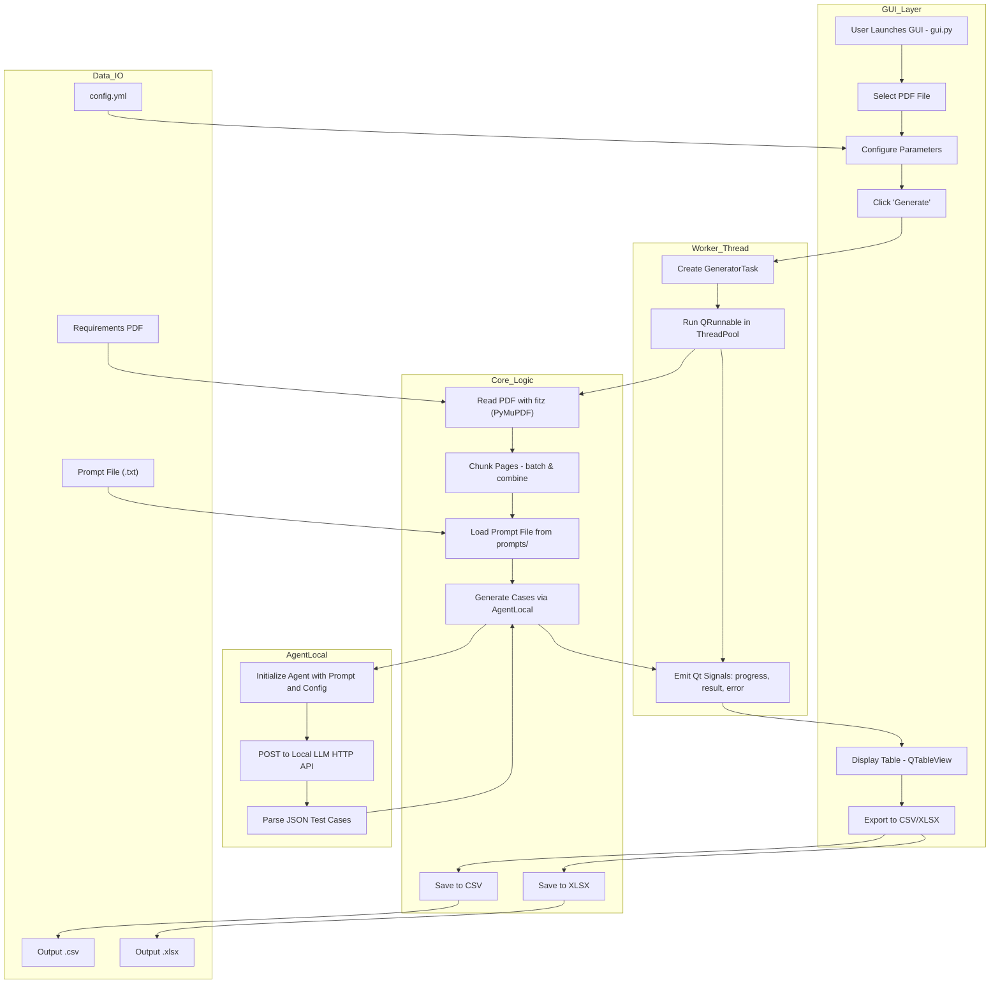

<div align="center">
  <h1>AuroraSpecDominion</h1>
</div>


<p align="center">
  
</p>

**AuroraSpecDominion** is a graphical Python application for converting unstructured requirement documents into structured, review-ready test cases. It ingests sources such as PDF specifications, applies deterministic parsing, and uses a locally hosted Large Language Model (via Ollama) to draft consistent test case candidates. The interface provides a guided workflow, configurable generation parameters, and export options for CSV and Excel, enabling clean integration with established test engineering processes.

The system accelerates early-phase test development by producing high-quality initial drafts that can be validated and refined by test architects. This reduces manual effort while maintaining traceability, structure, and engineering discipline.

**AuroraSpecDominion** requires a locally running Ollama instance configured with a supported model (for example mistral or llama3) to enable the generation pipeline.

**AuroraSpecDominion** reflects three ideas that define its identity:

* Aurora signals emergence and clarity, capturing the tool's role in revealing structure within complex requirements.
* Spec grounds the system in specification analysis and test derivation.
* Dominion conveys control over a domain, expressing the tool's purpose: governing and formalizing test knowledge with precision.

Together, the name represents a system engineered to illuminate unstructured input, shape it into consistent test logic, and provide a controlled environment for producing formal test specifications.

---

<p align="center">
  
</p>

---

## System Description

This architecture defines a desktop application that converts requirements from PDF files into structured test cases using a local LLM. It separates the user interface, background task execution, core data processing, and model communication into clear layers.

---

### 1. GUI Layer

* Purpose: Provides an interactive interface for users to load PDFs, configure options, and manage output.
* Key components:

  * `gui.py` launches the app.
  * Users select a PDF file, configure parameters (via `config.yml`), and click Generate.
  * A `QTableView` displays the generated test cases.
  * Users can export results to CSV or XLSX.

This layer communicates with the processing backend through worker threads to keep the UI responsive.

---

### 2. Worker Thread

* Purpose: Runs long operations asynchronously to avoid freezing the GUI.
* Key components:

  * Creates a `GeneratorTask` object.
  * Executes it as a `QRunnable` in a thread pool.
  * Emits Qt signals (`progress`, `result`, `error`) to update the UI.

This design ensures smooth user interaction while processing large PDFs or calling the LLM.

---

### 3. Core Logic

* Purpose: Handles the main document and data transformation pipeline.
* Key steps:

  * Reads PDFs using PyMuPDF (`fitz`).
  * Splits content into manageable chunks (batching and combining).
  * Loads a prompt file from `prompts/`.
  * Sends the prepared context to the local AI agent for test case generation.
  * Saves results to CSV or XLSX for export.

This layer forms the core processing pipeline between the raw document and final structured outputs.

---

### 4. Agent and LLM Integration

* Purpose: Generates structured test cases using a locally hosted LLM API.
* Workflow:

  * Initializes the agent with prompt and configuration.
  * Sends data via HTTP POST requests to the local LLM.
  * Parses JSON responses into structured test cases.

This decouples AI inference from the application's UI and processing logic.

---

### 5. Data I/O

* External files:

  * PromptFile (.txt): Custom prompt templates for guiding the LLM.
  * ConfigFile (`config.yml`): User-defined generation settings.
  * PDFInput: Source document containing requirements.
  * CSVOutput / XLSXOutput: Final test cases ready for external use.

---

### Key Design Characteristics

* Asynchronous execution keeps the interface responsive while heavy tasks run in the background.
* Modular structure: clear separation between UI, task management, core processing, and AI inference.
* Configurable and prompt-driven: allows easy customization through `config.yml` and prompt files.
* Local LLM support: enables offline or self-hosted AI inference without dependency on external services.

---



* GUI Layer: interaction flow via PySide6 components.
* Worker Layer: asynchronous thread management using `QRunnable` and `Signal`.
* Core Logic: PDF processing, chunking, and integration with the agent.
* Agent: the bridge to the locally running LLM via HTTP POST.
* Data I/O: all key files involved in input/output and configuration.

---

## Features

* LLM-powered: uses a local language model to extract and generate test cases from PDF documents.
* Context retrieval (optional): lightweight TF-IDF retrieval augments prompts with the most relevant requirement snippets.
* PDF support: splits and processes PDFs into chunks for better LLM input handling.
* User-friendly GUI: built using PySide6 for an accessible desktop interface.
* Highly configurable: batch size, prompt combinations, case generation counts, and more.
* Exports: outputs test cases to `.csv` or `.xlsx` format.
* Multithreaded processing: uses Qt's QRunnable/Signals to keep the GUI responsive during generation.
* GPU-aware inference: configure Ollama hardware options (number of GPUs, primary GPU, GPU layers) directly from the GUI for faster local inference when a compatible GPU is available.
* Script-friendly progress: optional `tqdm` progress bar mirrors GUI updates when running the core pipeline from a shell.
* Verbose observability: heartbeat progress updates and chunk-level log messages surface long-running work in both the GUI console and CLI scripts.
* Response caching: persist chunk-level responses to disk to avoid re-querying the LLM on repeated runs.
* Instant insights: automatic coverage summary highlights missing fields, duplicate names, and the most referenced requirements after each run.
* Inline help: integrated HTML-based documentation for parameter explanations.

---

## Installation

### Prerequisites

* Python 3.9+
* PySide6
* pandas
* openpyxl
* fitz (PyMuPDF)
* PyPDF2
* requests
* yaml
* scikit-learn (for retrieval augmentation)
* tqdm (for optional CLI progress bar)

Install dependencies:

```bash
pip install -r requirements.txt
```

---

## Usage

1. Launch the GUI:

   ```bash
   python gui.py
   ```

2. Upload a requirements PDF.

3. Adjust parameters like:

   * Batch size
   * Combine pages
   * Cases per prompt
   * Parallel prompts

4. Click Generate to run the test-case creation process.

5. Review and export results as `.csv` or `.xlsx`.

### Automating from scripts / CLI

When you call `core.generate_test_cases` programmatically (for example from a batch
script), set `show_progress=True` to render a live `tqdm` bar that mirrors the
Qt progress callbacks and pass a `logger` (`print` works) to stream
chunk-by-chunk updates:

```python
from core import AgentLocal, generate_test_cases

agent = AgentLocal(model="llama3:8b")
cases = generate_test_cases(
    pdf_path="requirements.pdf",
    agent=agent,
    combine=3,
    show_progress=True,
    logger=print,
)
```

The bar automatically falls back to standard logging when `tqdm` is not
installed.

### Accelerating repeated runs with disk caching

Re-running the generator with the same PDF and prompt is near-instant once
you enable the disk cache. Tick "Enable disk cache for chunk responses"
from the GUI (Performance and Cache panel) or configure it via `config.yml`:

```yaml
cache:
  enabled: true
  directory: ~/.tsg-cache
  max_entries: 256
  max_age_hours: 24
```

Each chunk prompt (model plus prompt content plus system instructions) is hashed and
stored alongside the repaired JSON response. On the next run the worker skips
LLM calls for any chunk that already exists within the TTL, providing dramatic
speed-ups when iterating on exports or prompt tweaks. Cache hits and misses are
logged in both the CLI and GUI log pane so you can monitor effectiveness.

### Reading the instant insight panel

After every generation the right-hand Insights box summarizes test quality:

* Complete cases - how many test cases include all required JSON fields.
* Requirement coverage - count of unique requirement identifiers and the
  top references.
* Missing sections - required fields still empty so you can re-run or
  manually patch them.
* Duplicate names - highlights test cases that share titles.

These quick heuristics make it easier to spot coverage gaps before exporting to
Excel or pushing the results downstream.

### Enabling GPU acceleration

Ollama automatically offloads work to the GPU when it detects a compatible
installation. TSG now exposes the relevant hardware knobs so you can steer that
behaviour from the GUI or from `config.yml`:

1. Install a GPU-capable Ollama build and vendor drivers (CUDA for NVIDIA,
   ROCm or Metal for AMD or Apple). Follow the official setup guide for your OS.

2. Verify GPU access directly in Ollama (outside of TSG) by running a quick
   prompt and observing the server log (it will mention that layers are being
   loaded onto the GPU), for example:

   ```bash
   ollama run llama3:8b "Hello"
   ```

3. In TSG's Model panel enable "GPU acceleration when available" to keep
   inference on the GPU. You can optionally override:

   * GPUs to use (`num_gpu`) - set to `Auto` to let Ollama pick or any
     positive integer to cap usage.
   * Primary GPU (`main_gpu`) - choose which GPU index should host KV cache
     allocations when you have multiple devices.
   * GPU layers (`gpu_layers`) - restrict the number of transformer layers to
     keep on the GPU when memory is limited.
   * CPU threads (`num_thread`) - fine tune CPU worker threads when you want
     to force CPU-only inference.

Disabling the checkbox forces Ollama to stay on the CPU (`num_gpu = 0`). All
settings persist to `config.yml` so scripted runs use the same hardware profile.

---

## Configuration Model

TSG persists the UI state to `config.yml`. The file now uses a structured layout to improve readability and enable advanced options:

```yaml
model:
  name: llama3:8b
  temperature: 0.4
  top_p: 0.9
  top_k: 64
  max_tokens: 8192
  use_gpu: true
  num_gpu: null        # "null" = auto, set 0 to force CPU or >0 to cap usage
  main_gpu: null       # choose a GPU index when you have multiple devices
  gpu_layers: null     # limit how many layers stay on the GPU (auto by default)
  num_thread: null     # override CPU worker threads when forcing CPU mode
generation:
  cases_per_prompt: 6
  combine_pages: 3
  batch_size: 1
  parallel_prompts: 1
rag:
  enabled: true
  top_k: 2
  chunk_overlap: 1
cache:
  enabled: true
  directory: ~/.tsg-cache
  max_entries: 256
  max_age_hours: 24
paths:
  pdf_path: /abs/path/to/requirements.pdf
  prompt_path: /abs/path/to/system_prompt.txt
```

Legacy flat files remain supported and will be migrated to the nested layout
automatically when the GUI closes. Use the Context Enhancements panel in the
GUI to toggle retrieval augmentation, control the number of related chunks
appended to each prompt, and adjust chunk overlap. The Performance and Cache
panel mirrors the `cache` section so you can switch caching on and off, tweak
TTL, and point the cache at faster storage without hand-editing YAML.

---

## Project Structure

```shell
tsg/
├── config.yml              # Default parameter configurations
├── config_.yml             # Backup or example config
├── core.py                 # Core logic -> prompt handling, case generation, export
├── documentation.py        # Embedded HTML documentation for UI
├── gui.py                  # GUI definition using PySide6
├── icon.png                # Application icon
├── qmodels.py              # Qt model for table-based data display
├── workers.py              # Background threads for async generation
├── config_models.py        # Dataclasses describing persistent configuration and defaults
├── tss/                    # Test specification suite
├── requirements/           # Dummy requirements for rear axle steering
└── prompts/
    ├── Prompt_Beginner_Test_Architect.txt
    ├── Prompt_Advanced_Test_Architect.txt
    └── Prompt_Expert_Test_Architect.txt
```

---

## Prompt Customization

* System prompts are stored in the `prompts/` directory.
* You can edit these text files to tailor how the LLM interprets and generates test cases.

---

## Example Use Case

1. A test architect uploads a 20-page requirements PDF.
2. The app chunks the document into batches.
3. Each chunk is fed into the LLM using the defined prompt.
4. The app assembles structured test cases and displays them.
5. The user exports the list to Excel for further QA workflows.

---

## Testing

The repository includes unit tests for key parsing and retrieval helpers. Execute them with:

```bash
pytest
```

---

## LLM Pipeline Improvements

* Prompt overrides - choose any prompt file to override the default system prompt from within the GUI.
* Resilient generation - automatic JSON retry plus self-repair of incomplete fields.
* Retrieval augmentation - optional TF-IDF retriever selects the most relevant chunks for each prompt.
* Health checks - Ollama availability is probed before generation, falling back to the CLI if required.

---

## Notes

* The application assumes a local LLM API is running and accessible via HTTP.
* Make sure your LLM supports multi-threading if using the parallel prompts feature.
* Error handling and logging are included to support debugging and tracking.
