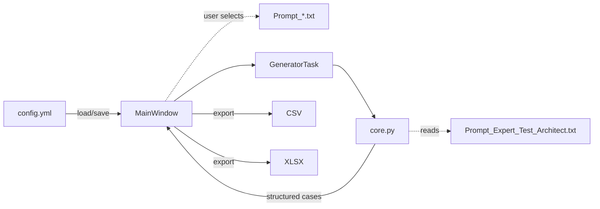
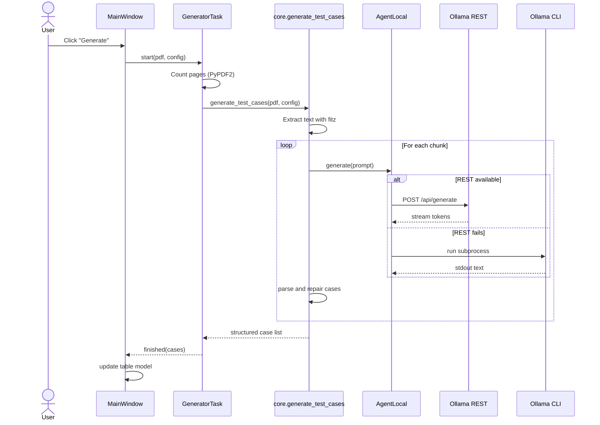
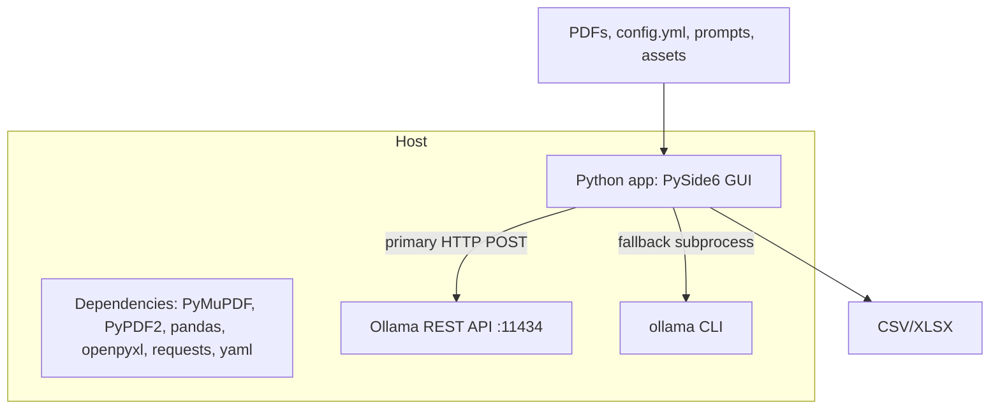

# Application Architecture

## Overview

The application is a **Python desktop program** with a **PySide6 GUI** for generating structured test cases from requirement PDFs.
It integrates with **Ollama** for LLM inference, providing both REST and CLI fallback communication. 

Its architecture emphasizes:

* Clear separation of UI, worker, core, and model integration
* Asynchronous background processing
* Resilience via dual-path Ollama communication
* Modular configuration and prompt handling
* Export capabilities for external consumption (CSV/XLSX)
* Hardware-aware inference toggles so Ollama can prefer the GPU when present
* Iteration-friendly tooling through response caching and post-run analytics

---

## Component Architecture

### 1. User Interface (UI)

* **MainWindow**
  Acts as the central controller for user actions:

  * Provides the **Generate** button to start tasks.
  * Displays results using **TestCaseTableModel**.
  * Loads/saves configuration from `config.yml`.
  * Allows selection of user prompts (`Prompt_*.txt`).
  * Provides access to a static help file (`PARAMETER_DOC`).
  * Offers export to **CSV/XLSX**.
  * Hosts the **Performance & Cache** panel to toggle disk caching and tune TTL/size.
  * Renders the **Insights** panel with quality heuristics (coverage, duplicates, missing fields).

### 2. Worker

* **GeneratorTask**
  Runs asynchronously to keep the GUI responsive:

  * Validates PDF by counting pages with **PyPDF2**.
  * Launches `core.generate_test_cases` with PDF and configuration.
  * Instantiates an optional `PromptCache` so repeated runs can short-circuit LLM calls.
  * Emits signals when processing is complete, delivering results to the UI.

### 3. Core Logic

* **generate\_test\_cases** orchestrates the pipeline:

  * Uses **PyMuPDF (fitz)** to extract text pages.
  * Splits content into manageable chunks (with optional overlap for RAG).
  * Optionally enriches prompts with TF–IDF selected related snippets.
  * Constructs prompts for each chunk and retries when JSON is malformed.
  * Sends prompts to `AgentLocal.generate`.
  * Parses model outputs into structured test cases.
  * Repairs malformed or incomplete outputs into valid JSON structures.
  * Stores successful chunk responses inside `PromptCache` (when enabled) and reuses them on future runs.
* Returns a list of dictionaries, each representing one structured case.

* **summarise\_cases** aggregates quick QA metrics (complete cases, requirement counts, duplicate names) for display in the GUI.

### 4. Model Integration

* **AgentLocal.generate** manages Ollama communication:

  * **Primary path**: HTTP POST to `http://localhost:11434/api/generate`, receiving streaming JSON token chunks.
  * **Fallback path**: Runs `ollama run {model}` as a subprocess and captures stdout.
  * Provides a lightweight health check before generation and a helper to build `[SYSTEM]` prompts.
  * Applies the user-selected GPU/CPU hints (`num_gpu`, `main_gpu`, `gpu_layers`, `num_thread`) so inference is routed to the desired hardware profile.
* Always assembles and returns a complete generation string.

* **config_models.AppConfig** harmonises configuration between GUI, persistence, and worker threads.

---

## Data and Configuration Flow

* **Config.yml**: Stores paths, numeric parameters, and model options.
* **Prompt files**: User-selected prompt + fixed system prompt (`Prompt_Expert_Test_Architect.txt`).
* **Flow**:
  User starts generation → Worker executes core → Core returns cases → Worker emits → GUI updates.
* **Export**: GUI supports export to CSV and XLSX.

---

## End-to-End Workflow

Steps:

1. User clicks **Generate**.
2. GUI launches `GeneratorTask` with PDF/config.
3. Worker validates PDF (page count).
4. Worker calls core logic.
5. Core extracts PDF text and processes chunks.
6. AgentLocal sends prompts to Ollama (REST or CLI).
7. Results are parsed and repaired.
8. Cases returned to worker.
9. Worker signals GUI.
10. GUI updates its table.

---

## Runtime Deployment

* **Execution**: Entire system runs locally on a host machine.
* **Dependencies**:

  * PDF parsing: PyMuPDF, PyPDF2
  * Data export: pandas, openpyxl
  * Config: yaml
  * HTTP communication: requests
* **Integration**: REST (preferred) + CLI fallback.
* **Inputs**: PDFs, config, prompts.
* **Outputs**: Structured test cases (in-app + CSV/XLSX).
